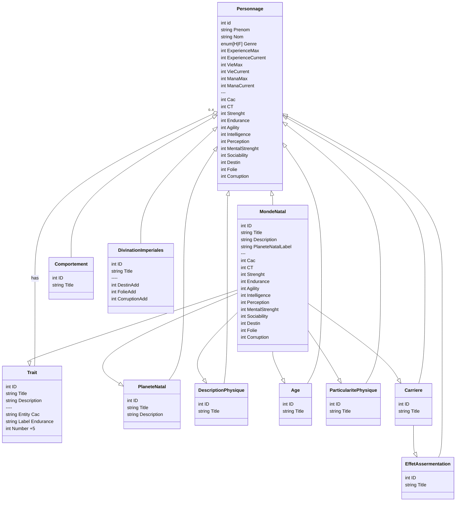

# Diagramme relations (mermaid)

```mermaid
classDiagram
    class Personnage {
      int id
      string Prenom
      string Nom
      enum[H|F] Genre
      int ExperienceMax
      int ExperienceCurrent
      int VieMax
      int VieCurrent
      int ManaMax
      int ManaCurrent
      ---
      int Cac
      int CT
      int Strenght
      int Endurance
      int Agility
      int Intelligence
      int Perception
      int MentalStrenght
      int Sociability
      int Destin
      int Folie
      int Corruption
    }
    class MondeNatal {
      int ID
      string Title
      string Description
      string PlaneteNatalLabel
      ---
      int Cac
      int CT
      int Strenght
      int Endurance
      int Agility
      int Intelligence
      int Perception
      int MentalStrenght
      int Sociability
      int Destin
      int Folie
      int Corruption
    }
    class Trait {
      int ID
      string Title
      string Description
      ----
      string Entity Cac
      string Label Endurance
      int Number      +5
    }
    class PlaneteNatal {
      int ID
      string Title
      string Description
    }
    class DescriptionPhysique {
      int ID
      string Title
    }
    class Age {
      int ID
      string Title
    }
    class Comportement {
      int ID
      string Title
    }
    class ParticularitePhysique {
      int ID
      string Title
    }
    class Carriere {
      int ID
      string Title
    }
    class DivinationImperiales {
      int ID
      string Title
      ----
      int DestinAdd
      int FolieAdd
      int CorruptionAdd
    }
    class EffetAssermentation {
      int ID
      string Title
    }


    Personnage "0..4" o-- Trait : has
    Personnage <|-- MondeNatal
    Personnage <|-- PlaneteNatal
    Personnage <|-- DescriptionPhysique
    Personnage <|-- Age
    Personnage <|-- Comportement
    Personnage <|-- ParticularitePhysique
    Personnage <|-- Carriere
    Personnage <|-- DivinationImperiales
    Personnage <|-- EffetAssermentation

    MondeNatal --|> Trait
    MondeNatal --|> PlaneteNatal
    MondeNatal --|> DescriptionPhysique
    MondeNatal --|> Age
    MondeNatal --|> ParticularitePhysique
    MondeNatal --|> Carriere

    Carriere --|> EffetAssermentation
```

