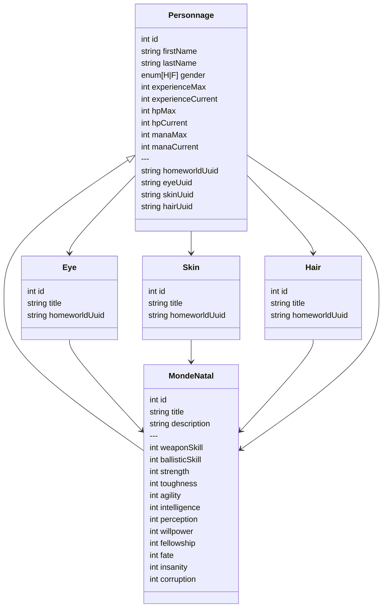

# Diagramme relations (mermaid)

> Correspondance Foundry VTT (v13)
>
> - `MondeNatal` est un **Item** de type `mondeNatal`.
> - `Eye` est un **Item** de type `eye` (titre uniquement).
> - `Skin` est un **Item** de type `skin` (titre uniquement).
> - `Hair` est un **Item** de type `hair` (titre uniquement).
> - Champs (implémentation actuelle) :
>   - `MondeNatal.item.name` → `title`
>   - `MondeNatal.item.system.description` → `description`
>   - `MondeNatal.item.system.stats.*` → caractéristiques :
>     `weaponSkill`, `ballisticSkill`, `strength`, `toughness`, `agility`, `intelligence`,
>     `perception`, `willpower`, `fellowship`, `fate`, `insanity`, `corruption`
>   - `Eye.item.system.homeworldUuid` → référence vers un `MondeNatal` (UUID)
>   - `Skin.item.system.homeworldUuid` → référence vers un `MondeNatal` (UUID)
>   - `Hair.item.system.homeworldUuid` → référence vers un `MondeNatal` (UUID)
>   - `Personnage.actor.system.homeworldUuid` → référence vers un `MondeNatal` (UUID)
>   - `Personnage.actor.system.eyeUuid` → référence vers un `Eye` (UUID)
>   - `Personnage.actor.system.skinUuid` → référence vers un `Skin` (UUID)
>   - `Personnage.actor.system.hairUuid` → référence vers un `Hair` (UUID)

