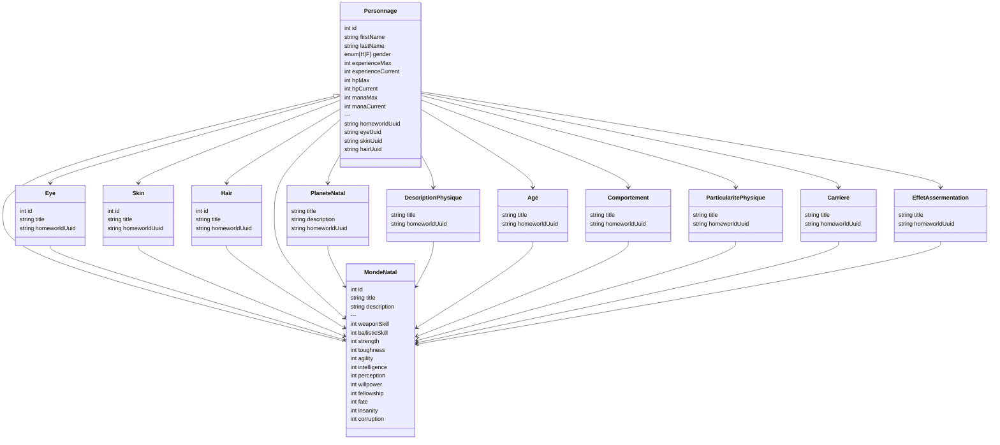

# Diagramme relations (mermaid)

> Correspondance Foundry VTT (v13)
>
> - `MondeNatal` est un **Item** de type `mondeNatal`.
> - `Eye` est un **Item** de type `eye` (titre uniquement).
> - `Skin` est un **Item** de type `skin` (titre uniquement).
> - `Hair` est un **Item** de type `hair` (titre uniquement).
> - `PlaneteNatal` est un **Item** de type `planeteNatal` (titre + description).
> - `DescriptionPhysique` est un **Item** de type `descriptionPhysique` (titre uniquement).
> - `Age` est un **Item** de type `age` (titre uniquement).
> - `Comportement` est un **Item** de type `comportement` (titre uniquement).
> - `ParticularitePhysique` est un **Item** de type `particularitePhysique` (titre uniquement).
> - `Carriere` est un **Item** de type `carriere` (titre uniquement).
> - `EffetAssermentation` est un **Item** de type `effetAssermentation` (titre uniquement).
>
>   - `MondeNatal.item.name` → `title`
>   - `MondeNatal.item.system.description` → `description`
>   - `MondeNatal.item.system.stats.*` → caractéristiques :
>     `weaponSkill`, `ballisticSkill`, `strength`, `toughness`, `agility`, `intelligence`,
>     `perception`, `willpower`, `fellowship`, `fate`, `insanity`, `corruption`
>   - `Eye.item.system.homeworldUuid` → référence vers un `MondeNatal` (UUID)
>   - `Skin.item.system.homeworldUuid` → référence vers un `MondeNatal` (UUID)
>   - `Hair.item.system.homeworldUuid` → référence vers un `MondeNatal` (UUID)
>   - `Personnage.actor.system.homeworldUuid` → référence vers un `MondeNatal` (UUID)
>   - `Personnage.actor.system.eyeUuid` → référence vers un `Eye` (UUID)
>   - `Personnage.actor.system.skinUuid` → référence vers un `Skin` (UUID)
>   - `Personnage.actor.system.hairUuid` → référence vers un `Hair` (UUID)
>   - `PlaneteNatal.item.system.homeworldUuid` → référence vers un `MondeNatal` (UUID)
>   - `PlaneteNatal.item.system.description` → description
>   - `DescriptionPhysique.item.system.homeworldUuid` → référence vers un `MondeNatal` (UUID)
>   - `Age.item.system.homeworldUuid` → référence vers un `MondeNatal` (UUID)
>   - `Comportement.item.system.homeworldUuid` → référence vers un `MondeNatal` (UUID)
>   - `ParticularitePhysique.item.system.homeworldUuid` → référence vers un `MondeNatal` (UUID)
>   - `Carriere.item.system.homeworldUuid` → référence vers un `MondeNatal` (UUID)
>   - `EffetAssermentation.item.system.homeworldUuid` → référence vers un `MondeNatal` (UUID)
>
>   - `Personnage.actor.system.planeteNatalUuid` → référence vers un `PlaneteNatal` (UUID)
>   - `Personnage.actor.system.descriptionPhysiqueUuid` → référence vers un `DescriptionPhysique` (UUID)
>   - `Personnage.actor.system.ageUuid` → référence vers un `Age` (UUID)
>   - `Personnage.actor.system.comportementUuid` → référence vers un `Comportement` (UUID)
>   - `Personnage.actor.system.particularitePhysiqueUuid` → référence vers un `ParticularitePhysique` (UUID)
>   - `Personnage.actor.system.carriereUuid` → référence vers un `Carriere` (UUID)
>   - `Personnage.actor.system.effetAssermentationUuid` → référence vers un `EffetAssermentation` (UUID)

