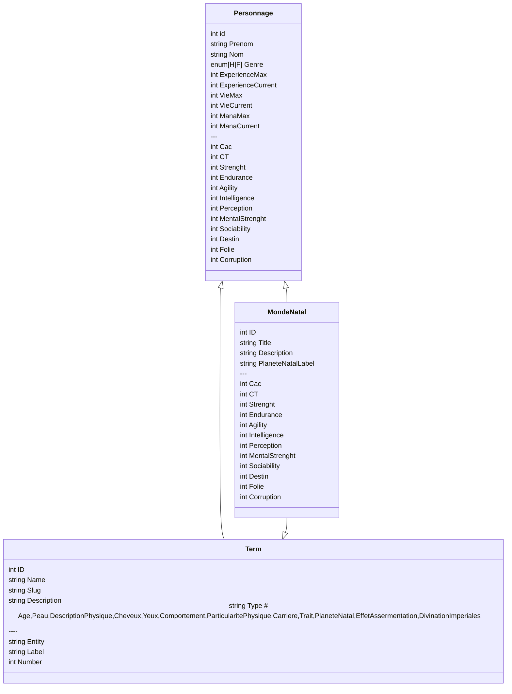

# Diagramme relations (mermaid)

```mermaid
classDiagram
    class Personnage {
      int id
      string Prenom
      string Nom
      enum[H|F] Genre
      int ExperienceMax
      int ExperienceCurrent
      int VieMax
      int VieCurrent
      int ManaMax
      int ManaCurrent
      ---
      int Cac
      int CT
      int Strenght
      int Endurance
      int Agility
      int Intelligence
      int Perception
      int MentalStrenght
      int Sociability
      int Destin
      int Folie
      int Corruption
    }
    class MondeNatal {
      int ID
      string Title
      string Description
      string PlaneteNatalLabel
      ---
      int Cac
      int CT
      int Strenght
      int Endurance
      int Agility
      int Intelligence
      int Perception
      int MentalStrenght
      int Sociability
      int Destin
      int Folie
      int Corruption
    }
    class Term {
      int ID
      string Name
      string Slug
      string Description
      string Type # Age,Peau,DescriptionPhysique,Cheveux,Yeux,Comportement,ParticularitePhysique,Carriere,Trait,PlaneteNatal,EffetAssermentation,DivinationImperiales
      ----
      string Entity
      string Label
      int Number
    }


    Personnage <|-- MondeNatal
    Personnage <|-- Term
    MondeNatal --|> Term
```

